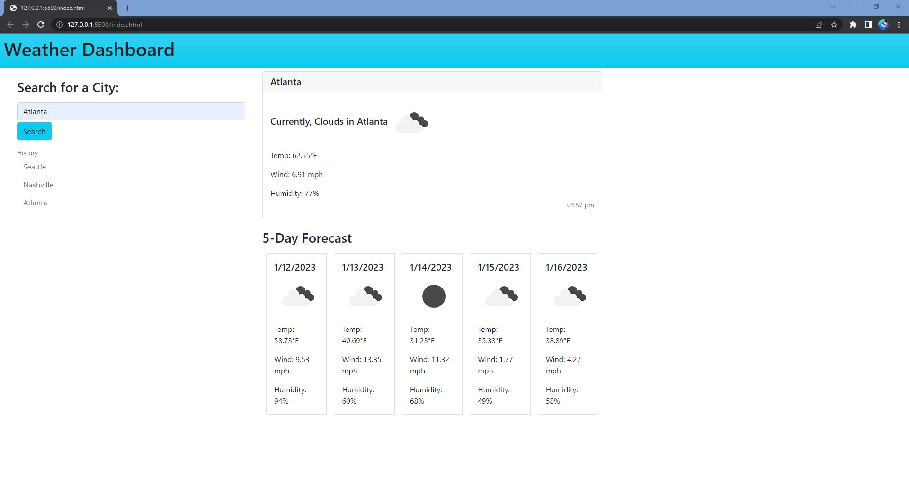

# weather-dashboard
## Description

This project is for the completion of challenge 06 in the GA Tech coding bootcamp. This weather dashboard functions to provide the user with current weather conditions and a 5-day forecast for a selected city. There is a search bar on the left side of the screen where the user will type their desired city to search for. When the user clicks search, the screen will populate with current weather conditions and a 5-day forecast. Additionally, the search will appear in the search history so the user can click a previous search and populate the screen with current conditons and the forecast. Overall, this project demonstrates my ability to use server-side APIs to create a web application to solve a real world problem.

<!-- ```
GIVEN a weather dashboard with form inputs
WHEN I search for a city
THEN I am presented with current and future conditions for that city and that city is added to the search history
WHEN I view current weather conditions for that city
THEN I am presented with the city name, the date, an icon representation of weather conditions, the temperature, the humidity, and the wind speed
WHEN I view future weather conditions for that city
THEN I am presented with a 5-day forecast that displays the date, an icon representation of weather conditions, the temperature, the wind speed, and the humidity
WHEN I click on a city in the search history
THEN I am again presented with current and future conditions for that city
``` -->

## Screenshot



## GitHub Pages Deployment
https://jeremystevens515.github.io/weather-dashboard/
